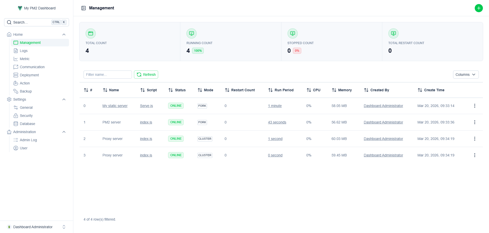
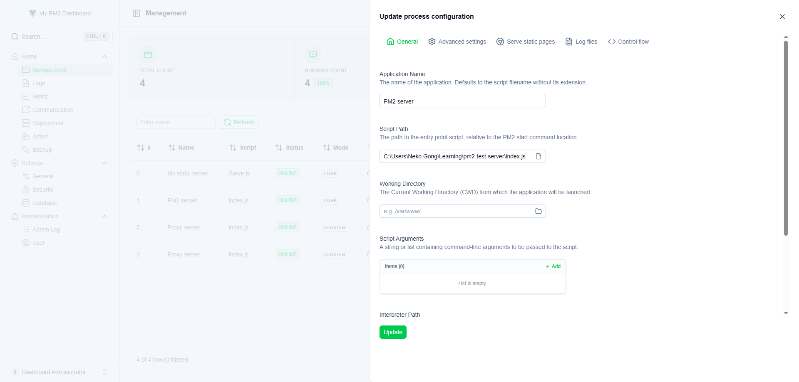
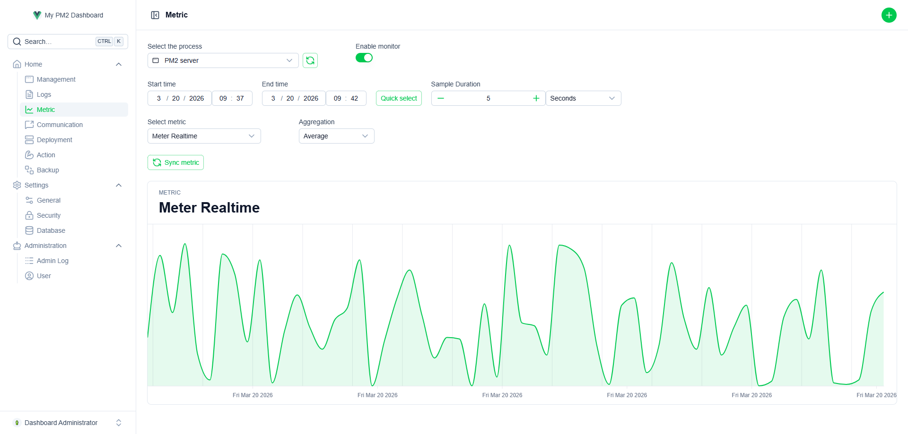
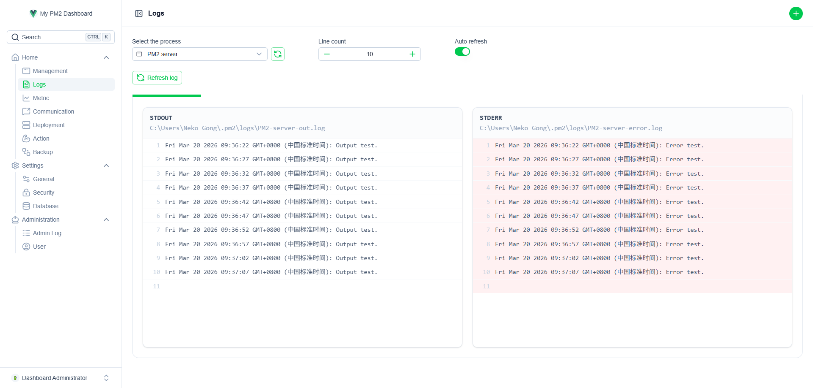
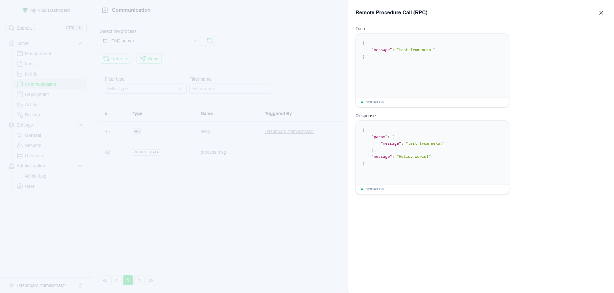
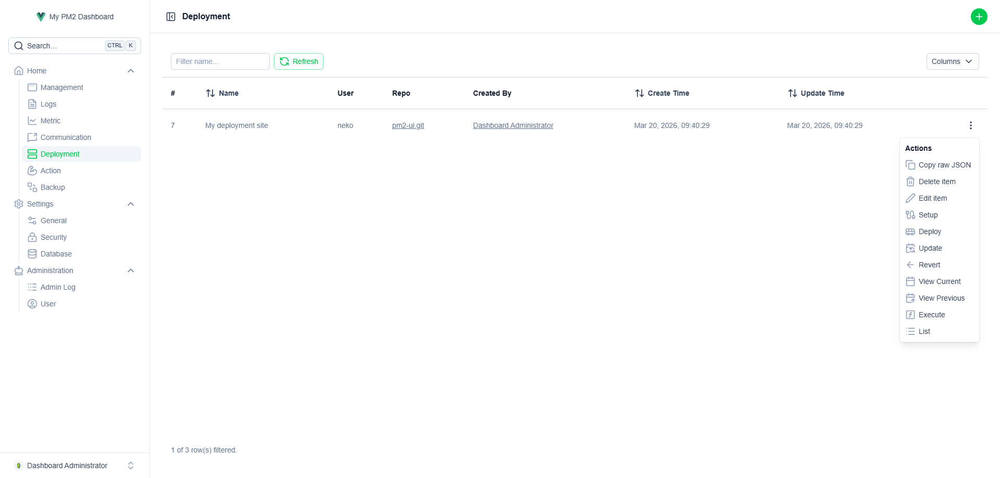
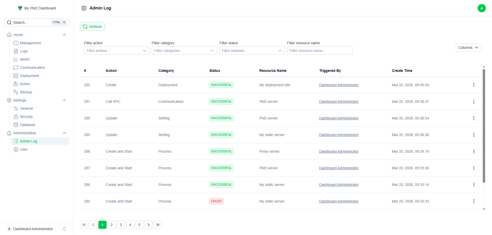

# PM2 UI

A full-featured, self-hosted web dashboard for [PM2](https://pm2.keymetrics.io/) — the Node.js process manager. Manage, monitor, and deploy your applications entirely from the browser.

  



## Why PM2 UI?

Most PM2 dashboards only cover the basics — start, stop, restart. PM2 UI goes further:

- **46 process creation parameters** across 5 categories (General, Advanced, Static Serve, Logs, Control Flow), with full parity to PM2's `ecosystem.config.js`
- **100% PM2 Functionality coverage** — every PM2 command is exposed through the UI
- **Built-in administration** — user management, role-based access control, audit logging, automated backups, and database maintenance out of the box
- **Zero external dependencies** — uses Node.js built-in SQLite (`node:sqlite`), no database setup required
- **Single-file deployment** — backend bundles to a single file via Rollup

## Features

### Process Management

- Create, start, stop, restart, reload, and delete processes
- Full 46-parameter configuration with grouped UI (General, Advanced, Static Serve, Log Files, Control Flow)
- Environment variable management with profile support (default, production, custom)
- File system browser for selecting script paths, working directories, and log files
- View process attributes, environment variables, custom metrics, and RPC actions



### Real-Time Monitoring

- Per-process CPU and memory metrics with configurable collection intervals
- Time-series charts with aggregation (AVG, SUM, MIN, MAX, COUNT) and adjustable sample duration
- Buffered metric collection to minimize database overhead



### Logs

- Tail stdout and stderr logs directly in the browser
- Configurable line count
- Auto-refresh mode



### IPC Communication

- Send data messages to processes (`process:msg`)
- Trigger Remote Procedure Calls (RPC) with parameter support
- Send OS signals (SIGINT, SIGTERM, etc.)
- Configurable message subscriptions with response tracking



### Deployment

- Full PM2 deployment workflow: setup → deploy → update → revert
- SSH configuration (key, user, hosts, options)
- Pre/post hooks for setup, deploy, and local operations
- Command output displayed in a terminal-style viewer



### Actions

- Reset restart counters, flush logs
- Generate startup/unstartup scripts
- Save and resurrect process lists
- Update the in-memory PM2 daemon
- Kill daemon, ping daemon

### Backup & Restore

- Snapshot all managed process configurations and deployments
- Automatic daily backups (midnight, configurable)
- Upload and restore from backup files
- Download backups as JSON

### Administration

- Multi-user support with super-user roles
- JWT authentication with configurable token expiration
- Per-action audit log (create, update, delete, login) with resource tracking
- Automatic database clean-up with configurable retention period
- JWT key regeneration
- CORS toggle



## Tech Stack

| Layer    | Technology                                                   |
| -------- | ------------------------------------------------------------ |
| Backend  | [Hono](https://hono.dev/), Node.js built-in SQLite, bcryptjs |
| Frontend | Vue 3, [Nuxt UI](https://ui.nuxt.com/) v4, Pinia             |
| Build    | Vite (frontend), Rollup (backend)                            |

## Requirements

- **Node.js ≥ 22.5** (required for `node:sqlite`)
- **PM2** installed globally (`npm i -g pm2`)
- **Administrator/root privileges** — this is an admin tool that interfaces directly with the PM2 daemon

## Quick Start

Download the latest release and extract it, then run:

```bash
node server.js
```

The server starts on port **12345** by default. Open `http://localhost:12345` in your browser.

To use a different port:

```bash
PORT=8080 node server.js
```

On first launch, the database is created automatically with a built-in super user:

- **Email**: `admin@example.com`
- **Password**: `admin`

Change these credentials immediately after your first login.

> **Windows users**: Run the terminal as Administrator. The PM2 daemon uses named pipes that require matching privilege levels.

## Development

### Install dependencies

```bash
cd backend && npm install
cd ../ui && npm install
```

### Run in development mode

Start the backend:

```bash
cd backend
node index.js
```

Start the frontend dev server:

```bash
cd ui
npm run dev
```

### Build for production

```bash
# Build frontend (outputs to dist/)
cd ui && npm run build

# Build backend (outputs to dist/server.js)
cd ../backend && npm run build
```

## Process Parameters

PM2 UI supports all 46 process configuration parameters, organized into 5 groups:

| Group | Parameters |
| --- | --- |
| **General** (7) | Application name, Script path, Working directory, Script arguments, Interpreter, Interpreter arguments, Node arguments |
| **Advanced** (16) | Instance count, Execution mode, Watch, Ignore watch, Max memory restart, Environment variables, Environment profiles, Append env to name, Source map support, Instance variable, Filter env, Increment variable, Stop exit codes, Exponential backoff restart delay |
| **Static Serve** (6) | Static files path, Serve port, Single-page application mode, Basic auth toggle, Basic auth username, Basic auth password |
| **Log Files** (8) | Log date format, Error log file, Output log file, Combined log file, Combine logs, Merge logs, Timestamp, PID file |
| **Control Flow** (9) | Minimum uptime, Listen timeout, Kill timeout, Shutdown with message, Wait ready, Max restarts, Restart delay, Auto-restart, Cron restart, Vizion, Post-update commands, Force |
